#  常见蜜罐体验和探索
## 实验目的
- 了解蜜罐的分类和基本原理
- 了解不同类型蜜罐的适用场合
- 掌握常见蜜罐的搭建和使用
## 实验环境
- Kali 2021.2
- [cowrie](https://github.com/cowrie/cowrie)
- [jaksi/sshesame](https://github.com/jaksi/sshesame)
## 实验要求
- [x] 记录蜜罐的详细搭建过程；
- [x] 使用`nmap`扫描搭建好的蜜罐并分析扫描结果，同时分析「 `nmap` 扫描期间」蜜罐上记录得到的信息；
- [x] 如何辨别当前目标是一个「蜜罐」？以自己搭建的蜜罐为例进行说明；
- [x] （可选）总结常见的蜜罐识别和检测方法；
- [ ] （可选）基于`canarytokens`搭建蜜信实验环境进行自由探索型实验；
## 环境配置
- 网络拓扑：

  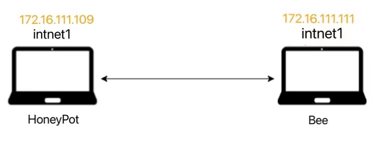
  
- 连通性测试：

  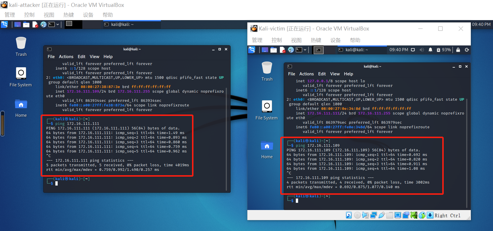

## 前期准备
- 安装Docker
  ```shell
  #换清华源
  #更新源
  $ sudo apt-get update
  #安装包以允许apt通过 HTTPS 使用存储库
  $ sudo apt-get install \
    ca-certificates \
    curl \
    gnupg \
    lsb-release
  #安装docker
  $ apt install docker.io python3-pip
  $ pip3 install docker-compose
  ```

## 实验过程
### 低交互蜜罐-`sshesame`
  >低交互蜜罐只会让攻击者非常有限地访问操作系统。“低交互”意味着，对手无法在任何深度上与您的诱饵系统进行交互，因为它是一个更加静态的环境。低交互蜜罐通常会模仿少量的互联网协议和网络服务，足以欺骗攻击者，而不是更多。通常，大多数企业都会模拟TCP和IP等协议，这使得攻击者可以认为他们正在连接到真实系统而不是蜜罐环境。

  >低交互蜜罐易于部署，不允许访问真正的root shell，也不使用大量资源进行维护。但是，低交互蜜罐可能不够有效，因为它只是机器的基本模拟。它可能不会欺骗攻击者参与攻击，而且它肯定不足以捕获复杂的威胁，如零日攻击。

**sshesame**是一个假的SSH服务器,让每个人都进入并记录他们的活动日志。该蜜罐GitHub仓库主页上提供了安装说明，操作简单，界面也比较友好。

- 下载安装`sshesame`
  ```shell
  $ git clone git://github.com/jaksi/sshesame.git
  $ cd sshesame 
  #安装gccgo-go/golang-go
  #go env -w GOPROXY=https://goproxy.cn
  $ go build
  ```
- 配置docker运行`sshesame`
  ```shell
  $ sudo docker run -it --rm\
    -p 127.0.0.1:2022:2022\
    -v sshesame-data:/data ghcr.io/jaksi/sshesame
  ```
- 启动`docker`并连接蜜罐`ssh -p 2022 127.0.0.1`

  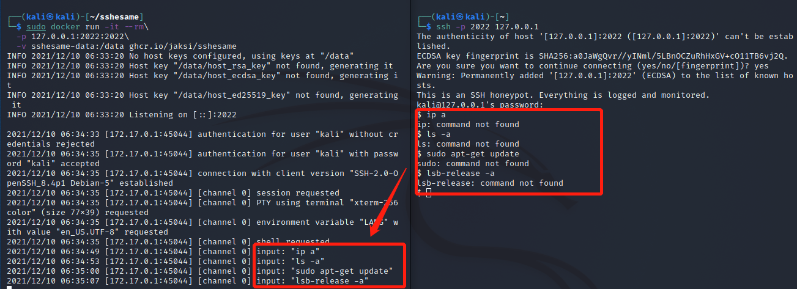

  >每一条命令都被记录了（甚至连密码也是..）。但是这只是个蜜罐，所以不存在实际命令，因此会出现`command not found`的报错

### 中等交互蜜罐-`Cowrie SSH Honeypot`
  >中等交互蜜罐是对真正的操作系统的各种行为的模拟，它提供了更多的交互信息，同时也可以从攻击者的行为中获得更多的信息。在这个模拟行为的系统中，蜜罐此时看起来和一个真正的操作系统没有区别，它们甚至是比真正系统还诱人的攻击目标。
- 选择**Cowrie**的原因：
  - cowrie是一种中等交互的SSH和Telnet蜜罐，旨在记录暴力攻击和攻击者执行的shell交互。Cowrie还充当SSH和telnet代理，以观察攻击者对另一个系统的行为。同时也是一个模拟的SSH服务器。很多攻击者都是SSH登录，你可以把这个软件在22端口启动，真正的SSH服务器放在另一个端口。当别人以为攻入了服务器，其实进入的是一个虚拟系统，然后会把他们的行为全部记录下来。
  - Github最近一次更新就在4天前，不用担心版本过期等问题。
- 下载安装`cowrie`
  ```shell
  # 克隆仓库
  git clone https://github.com/cowrie/docker-cowrie.git
  cd docker-cowrie/
  # 开启docker   
  #sudo su root
  docker pull cowrie/cowrie
  docker run -p 2222:2222 cowrie/cowrie
  ```
- nmap扫描发现开放的2222端口，并且过程被蜜罐记录
  
  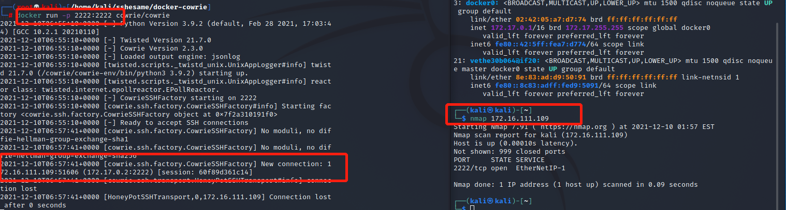

- ssh:以root身份连接蜜罐，注意端口号ssh -p 2222 xxx，因为只有这个端口是开放的。查看docker的情况，发现操作被清楚地记录，随意使用了一个密码登陆成功且密码被记录
  
  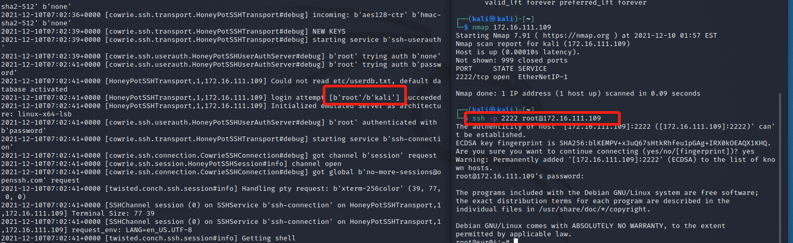

- 进行一些常规命令的测试

    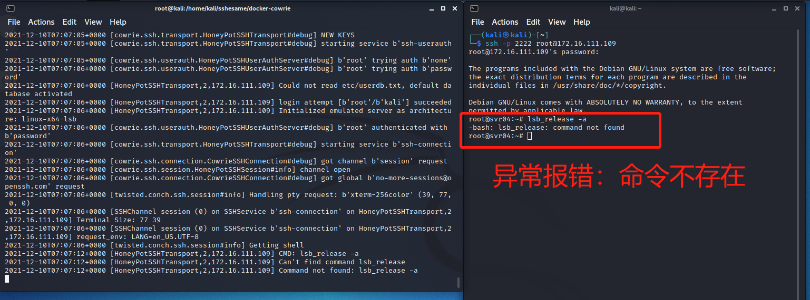

    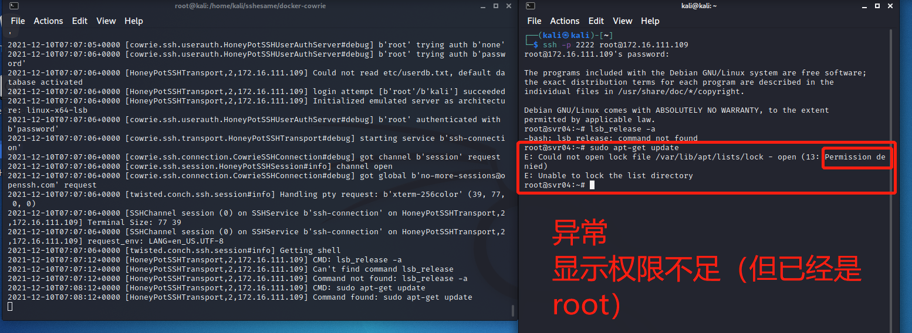

    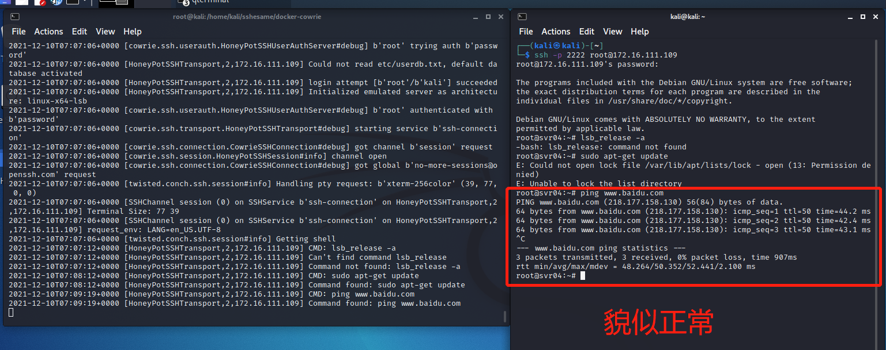

    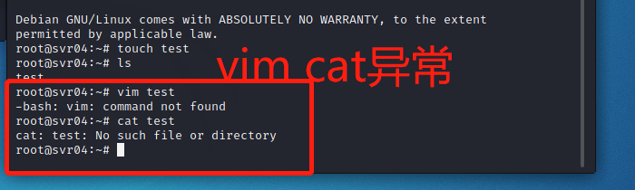

    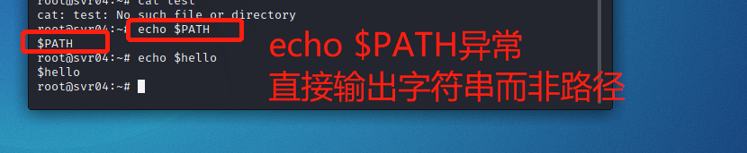

- 查看docker中的蜜罐日志

  ```shell
  # 将日志复制到本地查看
  docker cp 370f5bbebcd0:/cowrie/cowrie-git/var/log/cowrie /home/kali
  # jq带格式高亮查看 
  cat cowrie.json | jq '.'
  ```

- 开始分析日志

  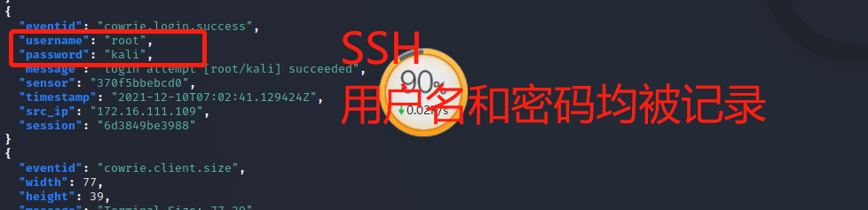

  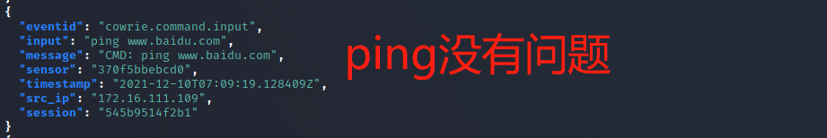

  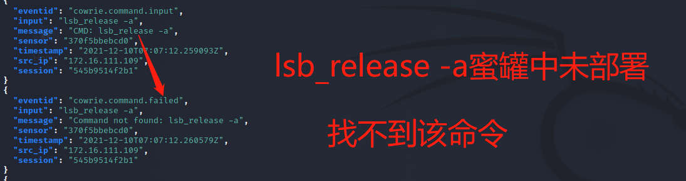

  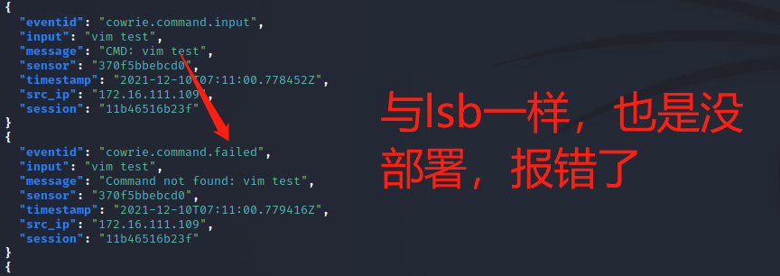

  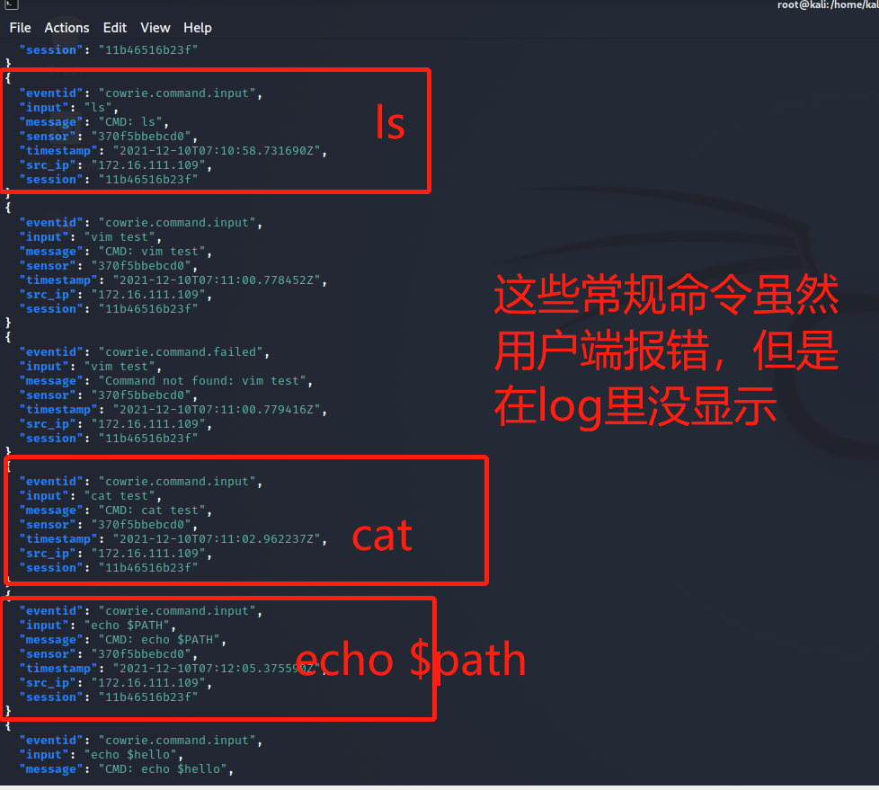

## (可选）总结常见的蜜罐识别和检测方法

- 比较容易的识别的是低交互的蜜罐，尝试一些比较复杂且少见的操作能比较容易的识别低交互的蜜罐，主要集中在模拟技术的检测上，通常存在着较为明显的特征。
- 相对困难的是高交互蜜罐的识别，因为高交互蜜罐通常以真实系统为基础来构建，和真实系统比较近似。对这种情况，通常用虚拟机探测技术进行识别，会基于虚拟文件系统和注册表的信息、内存分配特征、硬件特征、特殊指令等来识别。
>可以通过以下方式去做蜜罐识别：
1.BOF的识别；BOF（Back Officer Friendly）
2.假代理技术，关注Honeypot Hunter软件；
3.Honeyd的识别；
4.利用Sebek识别蜜网，第二、三代蜜网都有这个软件；
5.Tarpits的识别；
6.外联数据控制识别，一般蜜罐会严格限制系统向外的流量；
7.识别VMware虚拟机，重点关注MAC地址的范围
8.用Nmap等Scan工具，同一个机器同时开放很多Port的。
9.因为很多蜜罐都设置在相同或临近的网段。所以，同一个网段（e.g. ／24），很多机器都开放相同的Port，回应相似的Response。
10.去Shodan／Censys查

>检测：基于内核的 Sebek 组件用于捕获 SSH 和 SSL 加密的信息，常用于高交互蜜罐系统的数据捕获工具，可以对其进行检测。检测方法：
1.查看反应时间
2.观察网络传输计数器
3.修改系统调用表
4.查找隐藏模块

## 实验中遇到的问题

1. Docker安装问题：换个源就解决了
2. Go build 发生connection denined:原因是默认使用的是proxy.golang.org，在国内无法访问。
    - 解决方法：go env -w GOPROXY=https://goproxy.cn重新执行命令，可以正常执行！


## 参考链接

1. [cowrie](https://github.com/cowrie/cowrie)

2. [sshesame](https://github.com/jaksi/sshesame)

3. [老师的课件](https://c4pr1c3.gitee.io/cuc-ns/chap0x11/main.html)

4. [蜜罐检测](https://www.zhihu.com/question/31213254)

5. [docker cp命令](https://www.runoob.com/docker/docker-cp-command.html)

6. [师哥/师姐的作业](https://github.com/CUCCS/2018-NS-Public-jckling/blob/master/ns-0x11/0x11.md)