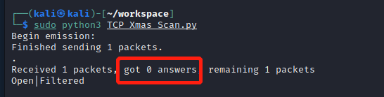
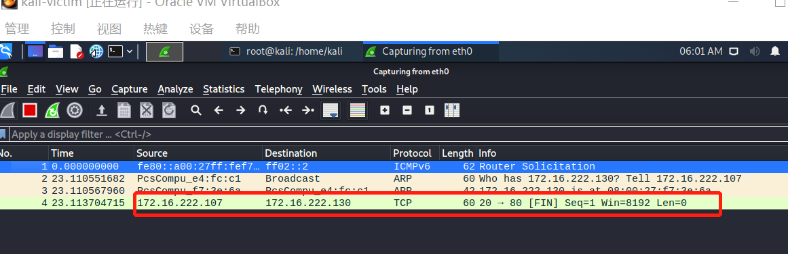

# 基于 Scapy 编写端口扫描器

## 实验目的

- 掌握网络扫描之端口状态探测的基本原理

## 实验环境

- Python 3.8

- Scapy 2.4.3

- Nmap 7.80

- Kali 5.7.0-kali1-amd64

## 主机配置情况

- Kali-Attacker

  * 172.16.222.107
  * 08:00:27:e4:fc:c1 / eth0(内部网络intnet2)

- Kali-Victim
  * 172.16.222.130
  * 08:00:27:f7:3e:6a / eth0（内部网络intnet2）

- GateWay
  * 172.16.222.1
  * 08:00:27:39:5b:43 / enp0s10（内部网络intnet2)

## 实验要求

- [x] 禁止探测互联网上的 IP ，严格遵守网络安全相关法律法规

- [x] 完成以下扫描技术的编程实现

  - [x] TCP connect scan / TCP stealth scan

  - [x] TCP Xmas scan / TCP fin scan / TCP null scan

  - [x] UDP scan

- [x] 上述每种扫描技术的实现测试均需要测试端口状态为:`开放`、`关闭`和`过滤`状态时的程序执行结果

- [x] 提供每一次扫描测试的抓包结果并分析与课本中的扫描方法原理是否相符？如果不同，试分析原因；

- [x] 在实验报告中详细说明实验网络环境拓扑、被测试 IP 的端口状态是如何模拟的

- [x] (可选)复刻 nmap 的上述扫描技术实现的命令行参数开关

## 实验过程

### 端口状态模拟方法

- 开放状态

  ```bash
  systemctl start apache2 #TCP测试apache2 端口号：80
  systemctl start dnsmasq #UDP测试DNS服务 端口号：53
  ```
  
  

- 过滤状态

  ```bash
  ufw enable && ufw deny 80/tcp
  ufw enable && ufw deny 53/udp
  ```
  
  

- 关闭状态

  ```bash
  systemctl stop apache2
  systemctl stop dnsmasq
  ```
  
  

### TCP Connect Scan

- [TCP_Connect_Scan.py](code/TCP_Connect_Scan.py)

  ```python
  #! /usr/bin/python
  from scapy.all import *

  dst_ip = "172.16.222.130"
  src_port = RandShort()
  dst_port=80

  tcpconnectscan_pkts = sr1(IP(dst=dst_ip)/TCP(sport=src_port,dport=dst_port,flags="S"),timeout=10)
  if tcpconnectscan_pkts is None:
    print("Filtered")
  elif(tcpconnectscan_pkts.haslayer(TCP)):
    if(tcpconnectscan_pkts.getlayer(TCP).flags == 0x12):
        print("Open")
    elif (tcpconnectscan_pkts.getlayer(TCP).flags == 0x14):
        print("Closed")
  ```

- 开启
  - 在Kali-Attacker运行python代码，发送数据包
    
  - 在Kali-Attacker使用WireShark工具，在eth0接口抓包
    
  - 用nmap扫描工具检验
    

- 关闭


- 过滤


### TCP Stealth Scan

- [TCP_Stealth_Scan.py](code/TCP_Stealth_Scan.py)

  ```python
  #! /usr/bin/python

  from scapy.all import *

  dst_ip = "172.16.222.130"
  src_port = RandShort()
  dst_port = 80

  pkts = sr1(IP(dst=dst_ip)/TCP(sport=src_port, dport=dst_port, flags="S"), timeout=10)
  if pkts is None:
    print("Filtered")
  elif(pkts.haslayer(TCP)):
    if(pkts.getlayer(TCP).flags == 0x12):
        send_rst = sr(IP(dst=dst_ip)/TCP(sport=src_port,dport=dst_port, flags="R"), timeout=10)
        print("Open")
    elif (pkts.getlayer(TCP).flags == 0x14):
        print("Closed")
  elif(pkts.haslayer(ICMP)):
    if(int(pkts.getlayer(ICMP).type) == 3 and int(pkts.getlayer(ICMP).code) in [1, 2, 3, 9, 10, 13]):
        print("Filtered")
  ```

- 开启
  - 在Kali-Attacker运行python代码，发送数据包
    
  - 在Kali-Attacker使用WireShark工具，在eth0接口抓包
    
  - 用nmap扫描工具检验
    

- 关闭


- 过滤


### TCP Xmas Scan

- [TCP_Xmas_Scan.py](code/TCP_Xmas_Scan.py)

  ```python
  #! /usr/bin/python

  import logging
  logging.getLogger("scapy.runtime").setLevel(logging.ERROR)

  from scapy.all import *

  dst_ip = "172.16.222.130"
  src_port = RandShort()
  dst_port = 80

  tcpxmasscan_pkts = sr1(
    IP(dst=dst_ip)/TCP(dport=dst_port, flags="FPU"), timeout=10)
  if tcpxmasscan_pkts is None:
    print("Open|Filtered")
  elif(tcpxmasscan_pkts.haslayer(TCP)):
    if(tcpxmasscan_pkts.getlayer(TCP).flags == 0x14):
        print("Closed")
  elif(tcpxmasscan_pkts.haslayer(ICMP)):
    if(int(tcpxmasscan_pkts.getlayer(ICMP).type) == 3 and int(tcpxmasscan_pkts.getlayer(ICMP).code) in [1, 2, 3, 9, 10, 13]):
        print("Filtered")
  ```

- 开启
  - 在Kali-Attacker运行python代码，发送数据包
    
  - 在Kali-Attacker使用WireShark工具，在eth0接口抓包
    
  - 用nmap扫描工具检验
    

- 关闭


- 过滤


### TCP FIN Scan

- [TCP_FIN_Scan.py](code/TCP_FIN_Scan.py)

  ```python
  #! /usr/bin/python

  import logging
  logging.getLogger("scapy.runtime").setLevel(logging.ERROR)

  from scapy.all import *

  dst_ip = "172.16.222.130"
  src_port = RandShort()
  dst_port = 80

  tcpfinscan_pkts = sr1(
    IP(dst=dst_ip)/TCP(dport=dst_port, flags="F"), timeout=10)
  if tcpfinscan_pkts is None:
    print("Open|Filtered")
  elif(tcpfinscan_pkts.haslayer(TCP)):
    if(tcpfinscan_pkts.getlayer(TCP).flags == 0x14):
        print("Closed")
  elif(tcpfinscan_pkts.haslayer(ICMP)):
    if(int(tcpfinscan_pkts.getlayer(ICMP).type) == 3 and int(tcpfinscan_pkts.getlayer(ICMP).code) in [1, 2, 3, 9, 10, 13]):
        print("Filtered")
  ```

- 开启
  - 在Kali-Attacker运行python代码，发送数据包
    
  - 在Kali-Attacker使用WireShark工具，在eth0接口抓包
    
  - 用nmap扫描工具检验
    

- 关闭


- 过滤




### TCP NULL Scan

- [TCP_NULL_Scan.py](code/TCP_NULL_Scan.py)

  ```python
  #! /usr/bin/python

  import logging
  logging.getLogger("scapy.runtime").setLevel(logging.ERROR)

  from scapy.all import *

  dst_ip = "172.16.222.130"
  src_port = RandShort()
  dst_port = 80

  tcpnullscan_pkts = sr1(
    IP(dst=dst_ip)/TCP(dport=dst_port, flags=""), timeout=10)
  if tcpnullscan_pkts is None:
    print("Open|Filtered")
  elif(tcpnullscan_pkts.haslayer(TCP)):
    if(tcpnullscan_pkts.getlayer(TCP).flags == 0x14):
        print("Closed")
  elif(tcpnullscan_pkts.haslayer(ICMP)):
    if(int(tcpnullscan_pkts.getlayer(ICMP).type) == 3 and int(tcpnullscan_pkts.getlayer(ICMP).code) in [1, 2, 3, 9, 10, 13]):
        print("Filtered")
  ```

- 开启
  - 在Kali-Attacker运行python代码，发送数据包
    
  - 在Kali-Attacker使用WireShark工具，在eth0接口抓包
    
  - 用nmap扫描工具检验
    

- 关闭


- 过滤


### UDP Scan

- [TCP_UDP_Scan.py](code/TCP_UDP_Scan.py)

  ```python
  #! /usr/bin/python

  import logging
  logging.getLogger("scapy.runtime").setLevel(logging.ERROR)

  from scapy.all import *

  dst_ip = "172.16.222.130"
  src_port = RandShort()
  dst_port = 53
  dst_timeout = 10

  def udp_scan(dst_ip,dst_port,dst_timeout):
    udp_scan_resp = sr1(IP(dst=dst_ip)/UDP(dport=dst_port), timeout=dst_timeout)
    if(udp_scan_resp is None):
        print("Open|Filtered")
    elif(udp_scan_resp.haslayer(UDP)):
        print("Open")
    elif(udp_scan_resp.haslayer(ICMP)):
        if(int(udp_scan_resp.getlayer(ICMP).type) == 3 and int(udp_scan_resp.getlayer(ICMP).code) == 3):
            print("Closed")
        elif(int(udp_scan_resp.getlayer(ICMP).type) == 3 and int(udp_scan_resp.getlayer(ICMP).code) in [1, 2, 9, 10, 13]):
            print("Filtered")
        elif(udp_scan_resp.haslayer(IP) and udp_scan_resp.getlayer(IP).proto == IP_PROTOS.udp):
            print("Open")

  udp_scan(dst_ip,dst_port,dst_timeout)
  ```

- 开启
  - 在Kali-Attacker运行python代码，发送数据包
    
  - 在Kali-Attacker使用WireShark工具，在eth0接口抓包
    
  - 用nmap扫描工具检验
    

- 关闭


- 过滤


## 实验中遇到的问题

- 问题一：下载dnsmasq的时候一直出现kali源不可达的报错，尝试过换清华源但依然不可达。
  - 思考：想了半天，最后突然想到是自己中途觉得网关GateWay主机没用，就把它关掉了的原因！
  - 解决：重启网关主机，再次apt-update && apt-install dnsmasq，成功安装

- 问题二：在用nmap扫描的方式检测53端口状态时，依然使用了`-sT`
  - 解决：用nmap --help查看帮助,发现扫描UDP的端口时应该用`-sU`
   

- 问题三：当端口为`过滤`状态的时候，用wireshark始终抓不到包
  - 思考：发现自己一直在Victim（被扫描）主机上抓包，本来以为数据包都是互相收发的，所以攻击者、被攻击者两边抓包应该没区别。但是没意识到，在把53（80）端口都过滤掉之后，wireshark就抓不到了（wireshark抓包是在过滤之后了）。因此什么也看不到
  - 解决：用攻击者主机抓包，看到了nmap发出的数据包。
  - `nmap --iflist`可以查看本地主机的接口信息和路由信息
  - `nmap -e eth0`可以指定eth0

- 问题四：UDP Scan工具，端口为`过滤`状态时，使用自己的python代码发包测试，和用nmap测试的结果不一样
  - 思考：正常现象。UDP协议会测不准

## 参考链接

- [Chapter5课件](https://c4pr1c3.gitee.io/cuc-ns/)
- [参考作业](https://github.com/CUCCS/2021-ns-public-EddieXu1125/tree/chap0x05/chap0x05)