# 基于 VirtualBox 的网络攻防基础环境搭建

## 实验目的
- 掌握 VirtualBox 虚拟机的安装与使用；
- 掌握 VirtualBox 的虚拟网络类型和按需配置；
- 掌握 VirtualBox 的虚拟硬盘多重加载

## 实验环境

- VirtualBox 虚拟机
- 攻击者主机（kali-Attacker）：Kali Rolling 2109.2
- 网关（Gateway）：Debian Buster
- 靶机（xp-victim）：xp-sp3
  
## 实验要求

- 虚拟硬盘配置成多重加载
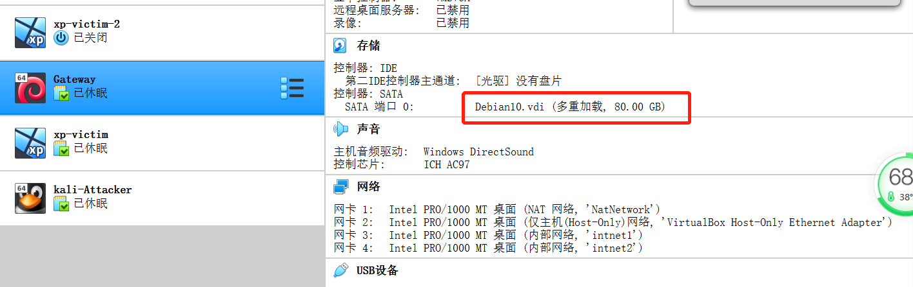
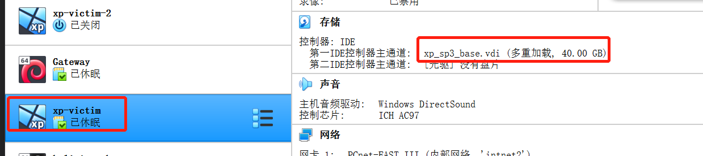
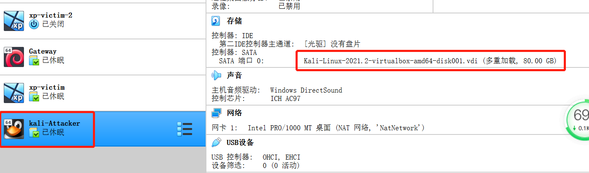
- 搭建满足要求的虚拟机网络拓扑
  - 攻击者主机（kali-Attacker）：Kali
  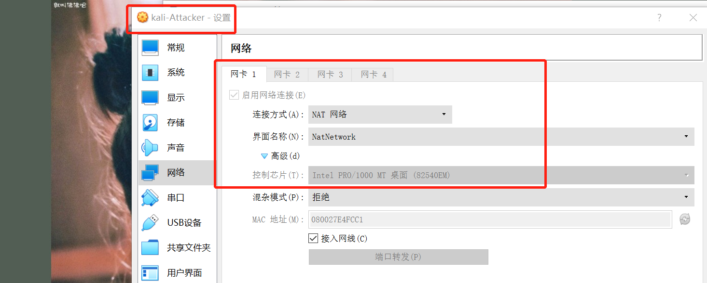
  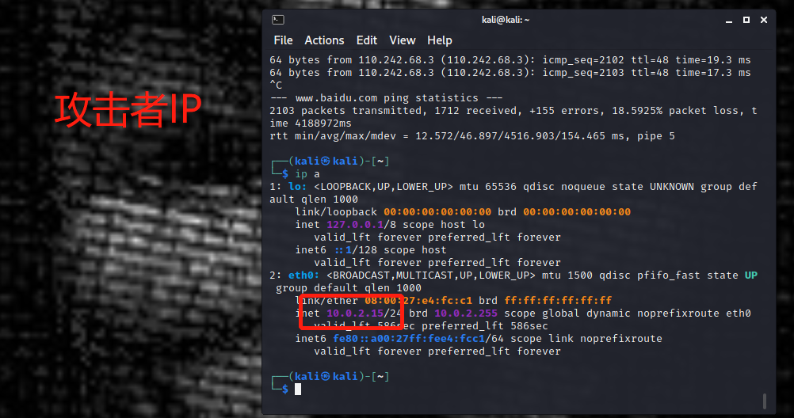
  - 网关（Gateway）：Debian10
  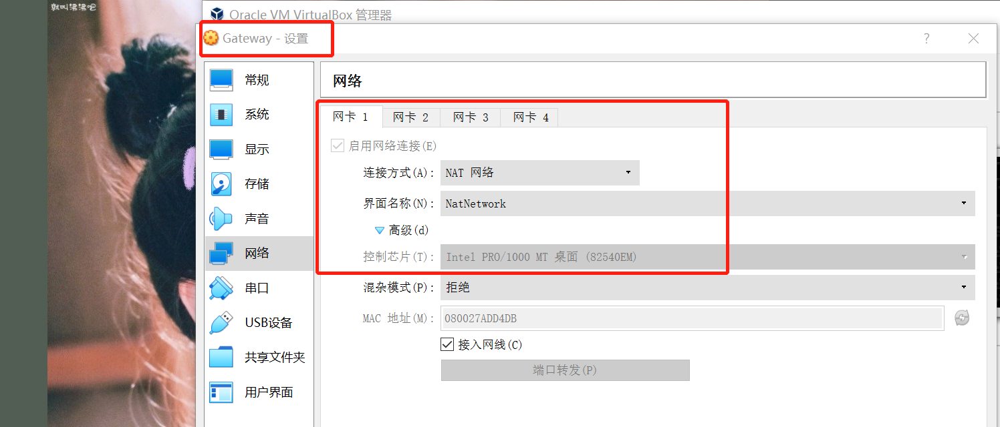
  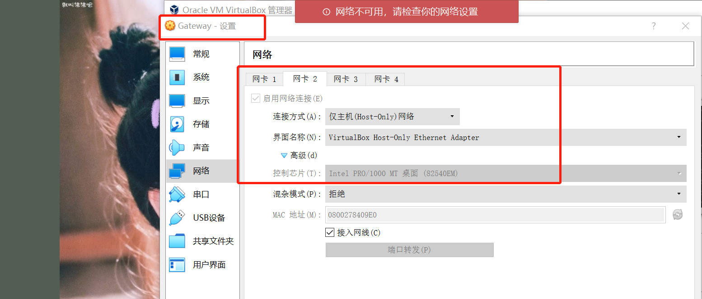
  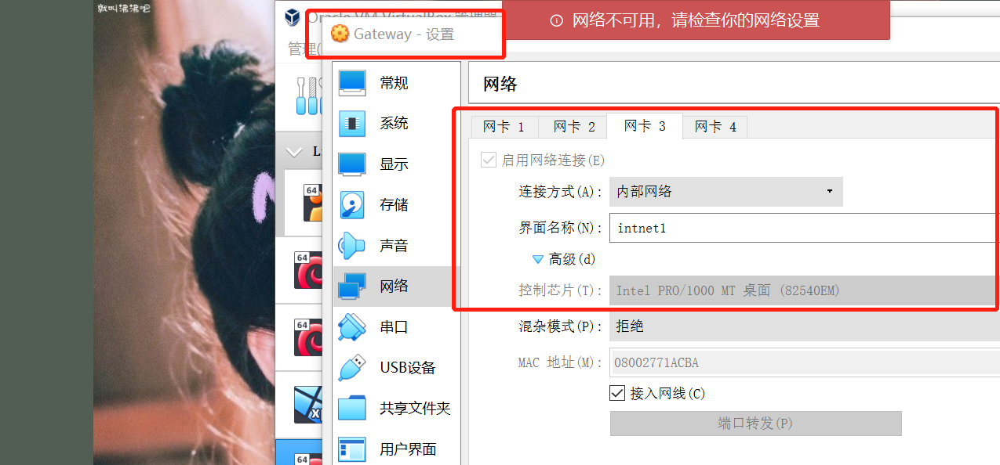
  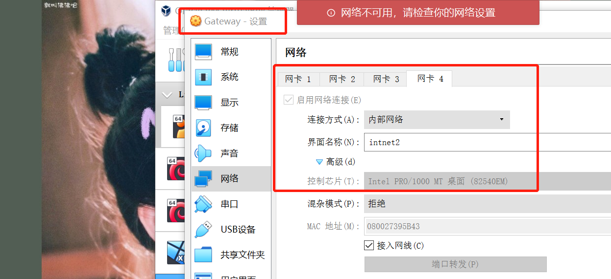
  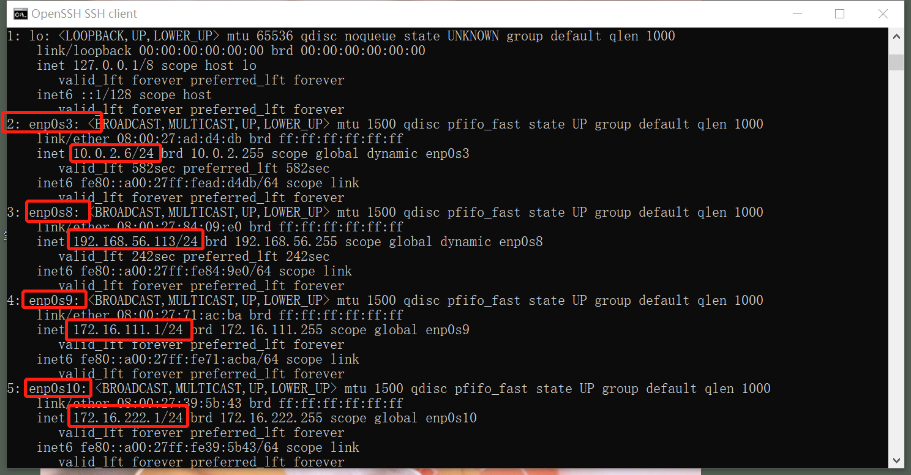
  - 靶机（xp-victim）：xp-sp3
  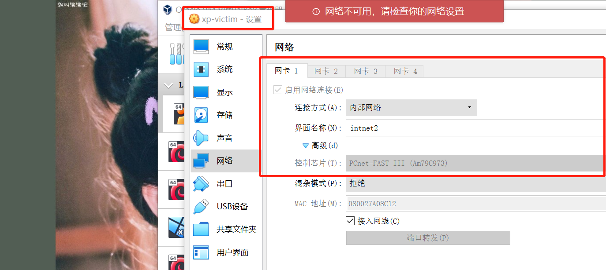
  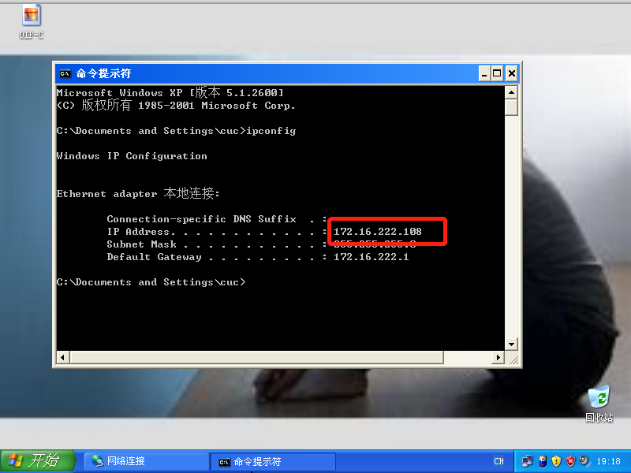
- 完成以下网络连通性测试
  - [x] 靶机可以直接访问攻击者主机
  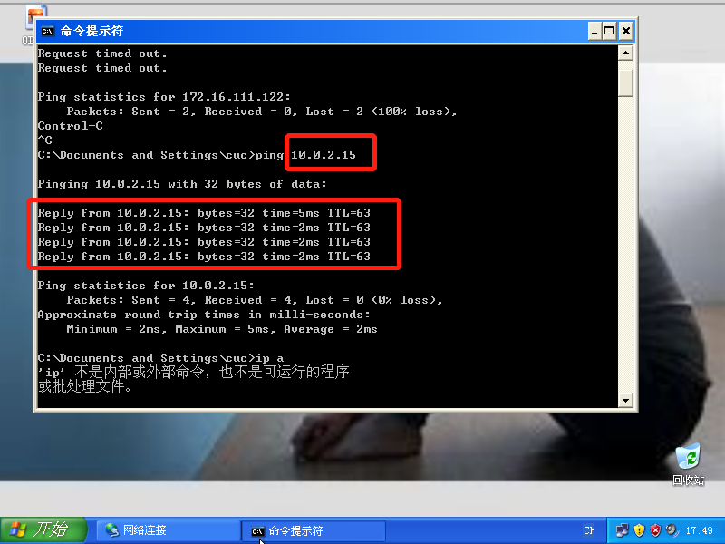
  - [x] 攻击者主机无法直接访问靶机
  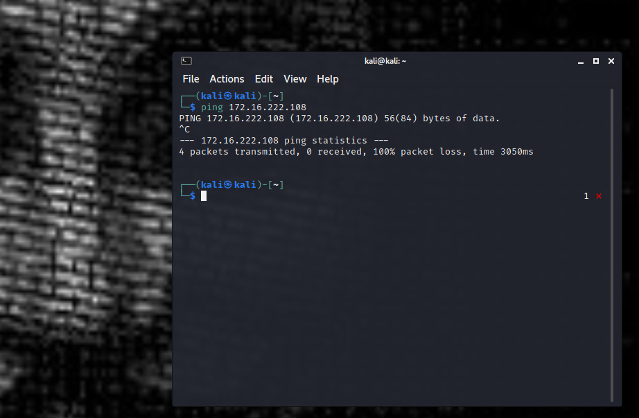
  - [x] 网关可以直接访问攻击者主机和靶机
  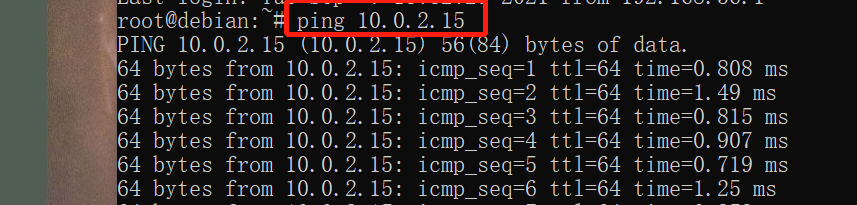
  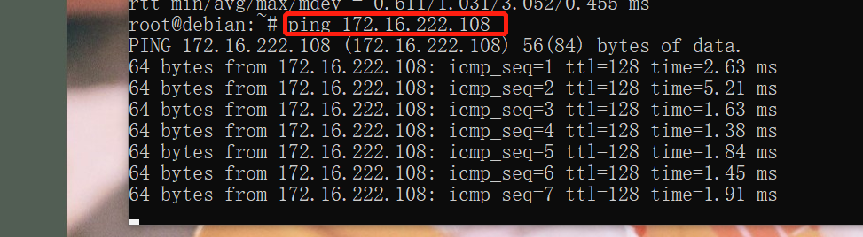
  - [x] 靶机的所有对外上下行流量必须经过网关
  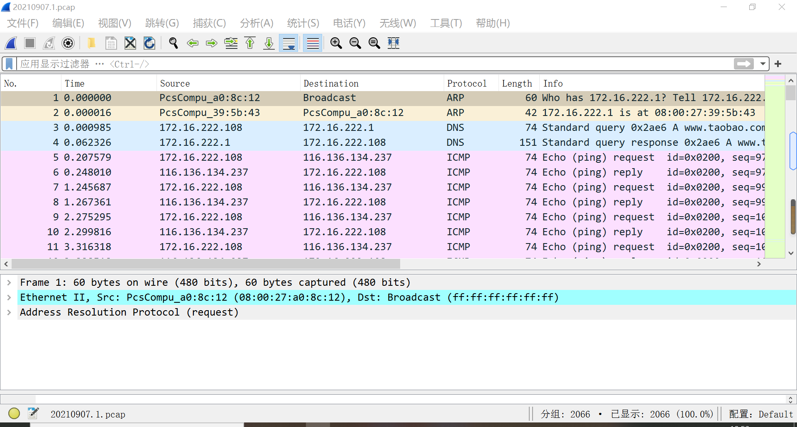
  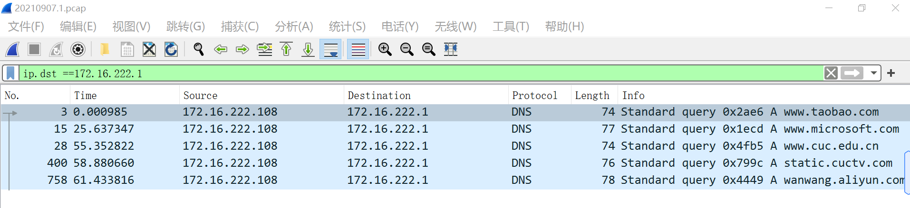
  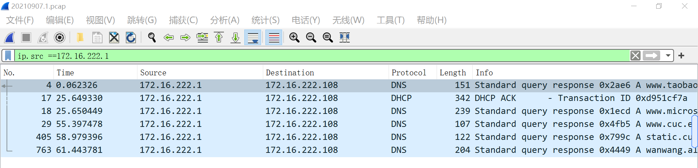
  - [x] 所有节点均可以访问互联网
  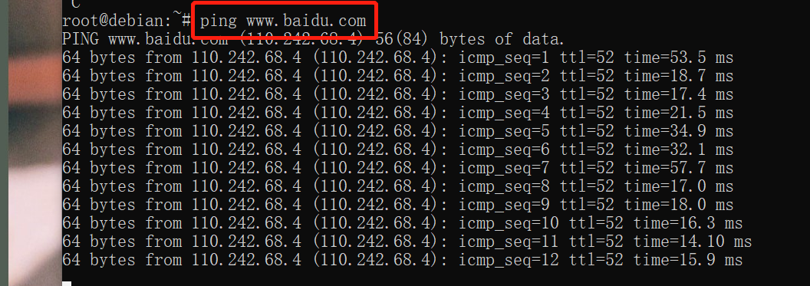
  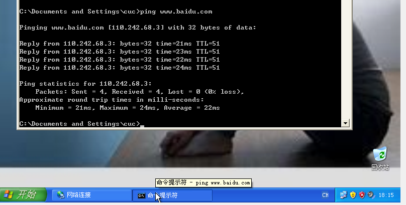
  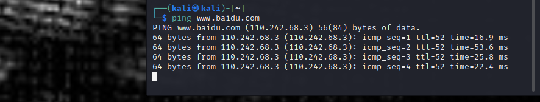

## 遇到的问题

### 问题一：本机ssh远程访问网关主机（192.168.56.113）时出现connection timeout的报错。

- 逐层检查
  - 检查物理层连通性：网卡已接入网线
  - 直接检查了网络层连通性，发现本机ping网关可以ping通，说明是上层出现了问题
  - 使用`ssh 192.168.56.113 -vv `查看日志，内容如下
  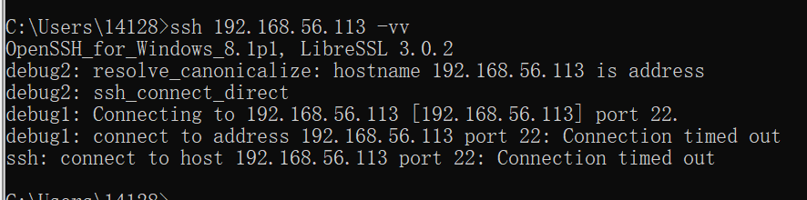
  发现就是网络不通。
- 发现问题
  - 怀疑与防火墙有关，`iotables -L -n |less`显示详细信息
  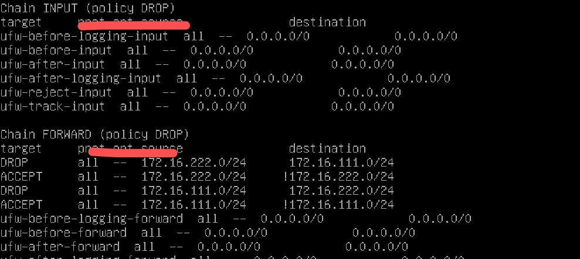
  - 发现是由于自己之前摸索防火墙端口禁用复用的时候，安装配置了ufw，与老师的虚拟机配置不同导致远程连接失败。
- 问题解决
  - 卸载ufw，再次ssh远程访问，可以正常连接。  

## 课后思考题
机密性 完整性 可用性 认证 授权 审计
- 以下⾏为分别破坏了CIA和AAA中哪⼀个属性或多个属性？
  - 小明抄小强的作业$\Rightarrow$机密性
  - 小明把小强的系统折腾死机了$\Rightarrow$可用性
  - 小明修改了小强的淘宝订单$\Rightarrow$机密性、完整性、可用性、认证
  - 小明冒充小强的信用卡账单签名$\Rightarrow$机密性、完整性、可用性、认证、授权
  - 小明把自⼰电脑的IP修改为小强电脑的IP，导致小强的电脑⽆法上⽹$\Rightarrow$可用性、认证、授权
- 有⼀次，小明⼝袋里有100元，因为打瞌睡，被小偷偷⾛了，搞得晚上没饭吃。又⼀天，小明⼝袋里有200元，这次小明为了防范小偷，不打瞌睡了，但却被强盗持⼑威胁抢⾛了，搞得⼀天没饭吃，小明当天就报警了。
  - 试分析两次失窃事件中的：风险、资产、威胁、弱点、攻击、影响
    - 第一次：
    风险$\Rightarrow$钱被偷走
    资产$\Rightarrow$人民币100元
    威胁$\Rightarrow$小偷
    弱点$\Rightarrow$打瞌睡
    攻击$\Rightarrow$偷
    影响$\Rightarrow$晚上没饭吃
    - 第二次：
    风险$\Rightarrow$钱被抢走
    资产$\Rightarrow$人民币200元
    威胁$\Rightarrow$强盗
    弱点$\Rightarrow$小明力量有限
    攻击$\Rightarrow$威胁
    影响$\Rightarrow$一天没饭吃
  - 试用P2DR模型分析以上案例中的“现⾦被抢”事件中的安全策略、安全防护、安全检测和安全响应
    - 安全策略：提高警戒防范意识，不可以打瞌睡
    - 安全防护：大脑思维意识
    - 安全检测：大脑的学习能力和经验教训
    - 安全响应：报警
  - “被抢”事件中，小明的安全策略存在何问题？
    - 问题：只考虑到了造成漏洞的一个方面，仅提升了软实力，没有考虑到自身的硬件缺陷。